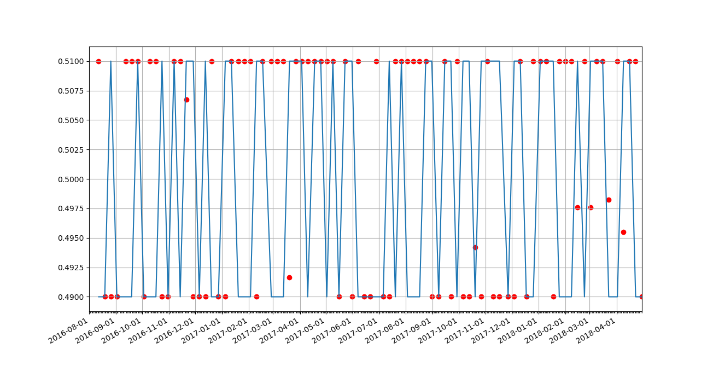
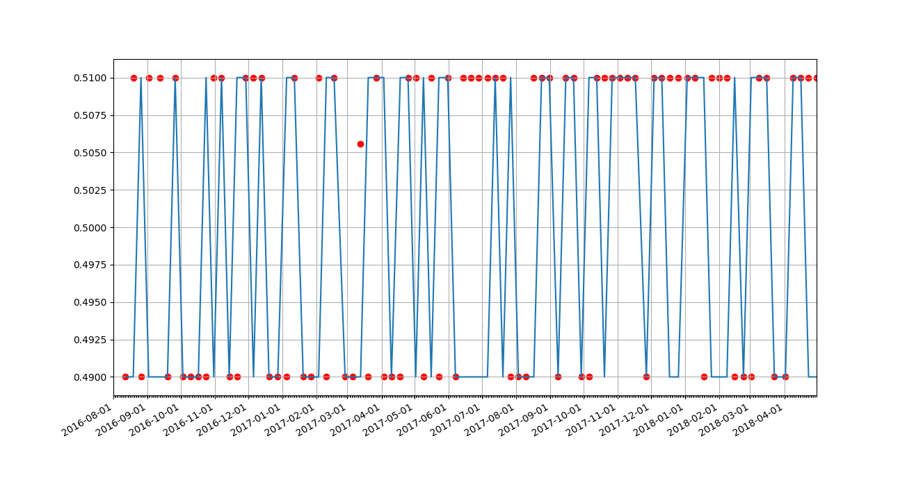
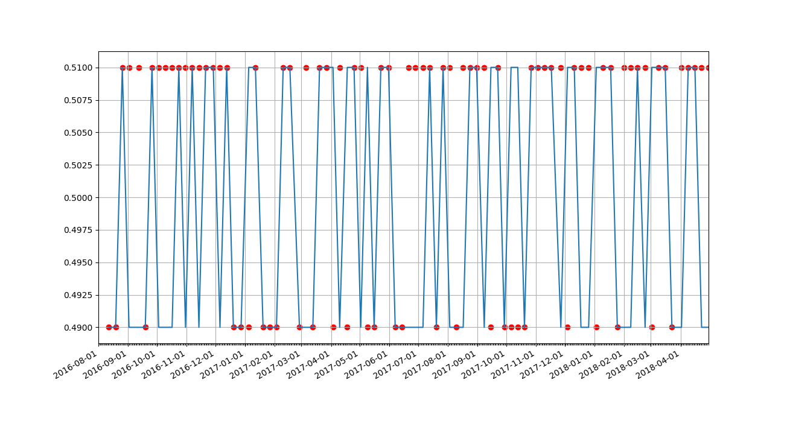
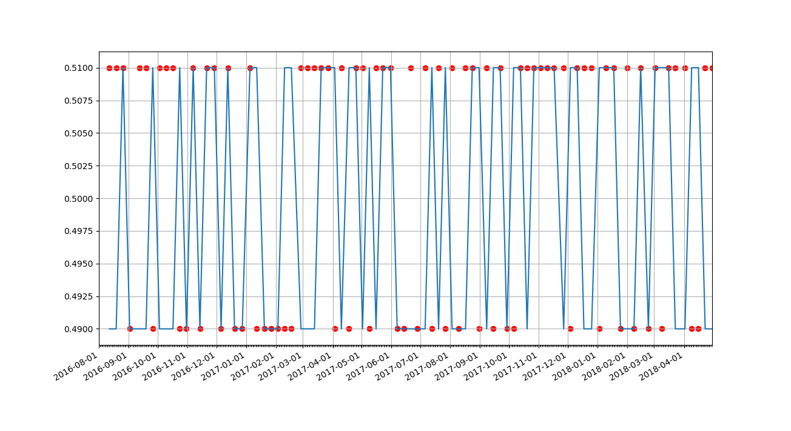

# Tweets-Price-Prediction
Scraping Twitter data for predicting stock prices

---

I do not believe that market price history alone is good enough to predict future prices, but that data can be augmented. An easily accessible source would be a brand's twitter feed. Apparently, twitter mood has been [correlated to stock prices](https://arxiv.org/pdf/1010.3003.pdf) before, in which sentiment analysis was applied to tweets and the results of that are inputted to a neural network.

~~This project attempts to scrape the tweets of certain brands and input them to neural network, with the historic prices of that brand's stock as labels. This way, there is no need for a separate sentiment analysis component. Unfortunately, I ran into difficulties with the character encoding of an obscure emoji, so~~ For training the models in this project, I will just use the numeric number of replies, retweets, and likes of each tweet.

I didn't use a [Twitter-specific API](https://developer.twitter.com/en/docs/basics/getting-started) to scrape Twitter data, to avoid having to download and install something I'd only use once.

## Models

[Convoutional neural networks](http://cs231n.github.io/convolutional-networks/) are used to learn from the temporal localities of the stock market time series and/or twitter feed information.

I also try [stacking models](https://www.kdnuggets.com/2016/11/data-science-basics-intro-ensemble-learners.html), to compare with a standalone neural network.

## Data

I train the networks on the historical stock price and twitter time series of Dunkin' Brands and validate the models on that of Starbucks'. 

The data is inputted as the past 5-days (a market week) worth of data for the convolutional neural networks. The output is a discrete binary variable, that classifies whether the next week's adjusted closing price is higher or lower than the present.

*I chose not to do short-term price regression, because I found simple networks would [uselessly overfit](https://github.com/Havorax/Crypto-Price-Prediction) the data.*

## Market Data Learner

This model only learns from the past week's market price data.

*Figure: Starbucks' actual adjusted closing price flux (blue) vs. prediction (red)* 

**Result**: 55% accuracy

## Twitter Data Learner

This model only learns from the past week's twitter feed data.

**Result**: 80% accuracy

*This result should not mean that twitter data is better than market data, for prediction. There is only about 1 year's worth of tweets and very few features for the twitter data.*

## Augmented Data Learner

This model learns from both market price data and twitter feed data.

**Result**: 83% accuracy

*This result was nice to see, but the predictions are so biased upwards (see chart above) that this model might not actually reflect anything useful about Starbucks' stock.*

## Stacked Learner

This ensemble learning model combines the predictions of both the market data learner and twitter data learner. Those two learners are used as the base models to train the meta model, a simple multilayer perceptron.

**Result**: 75% accuracy

*The validation accuracy of the stacked learner is less than the augmented data learner, but that doesn't mean it's worse. From the chart, this network seems to have less of a bias towards a single prediction and might be more suited for practical application.*

---

# Tools
All neural networks were implemented with [Keras](https://keras.io/).
Twitter data was scraped from the Twitter website, using the [Selenium package](https://pypi.org/project/selenium/) for Python.
